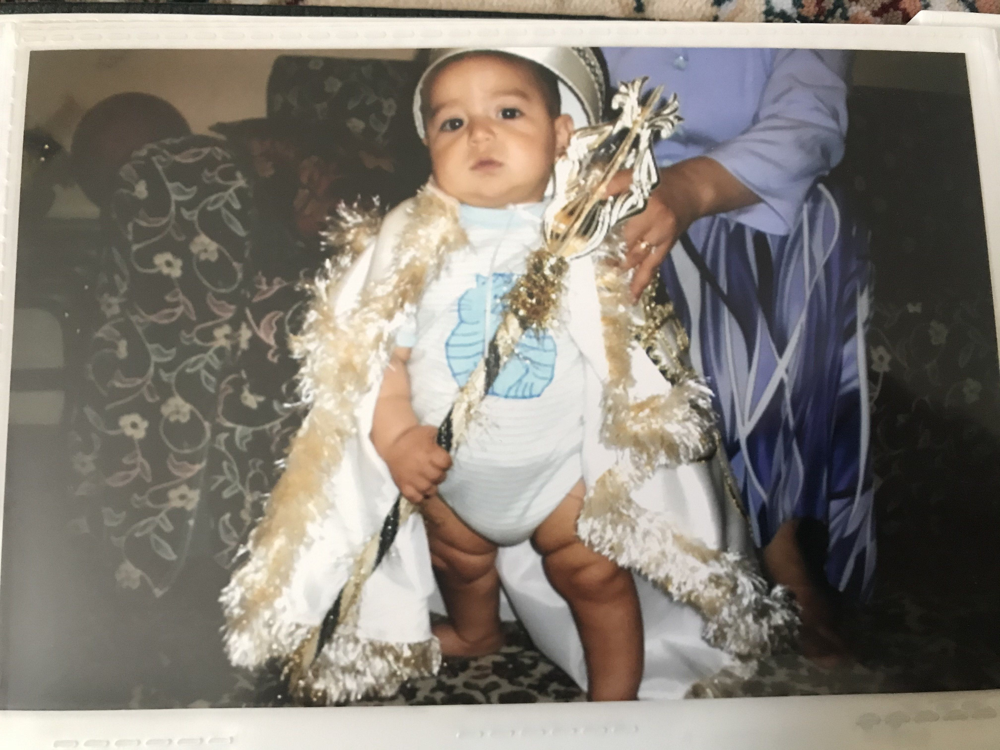
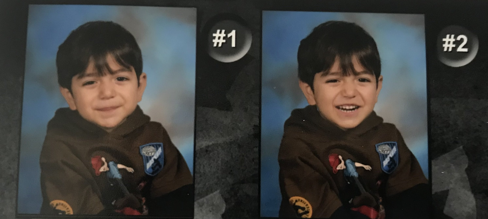

&nbsp;&nbsp;&nbsp;&nbsp; Hi, I'm Talha.

&nbsp;&nbsp;&nbsp;&nbsp; 𓆝 𓆟 𓆞 𓆝 𓆟𓆝 𓆟 𓆞 𓆝 𓆟

&nbsp;&nbsp;&nbsp;&nbsp; I'll keep this section strictly about me and reserve what the nature of this website is for a separate post for the fans.

## Early Life

&nbsp;&nbsp;&nbsp;&nbsp; A little bit of early background. I was born in Hamilton, Canada, but shortly after moved back to my moms home town; Uşak, Türkiye. I don't remember to much of my time in Türkiye— being so young at the time— but a core memory I formed was learning to play chess. It was actually taught at the school I attended; every Friday end of day was chess lessons. I think the reason I still play to this day are the fond memories I have of when I was learning the game. My aunt also taught more fundamentals at home, which sparked an intense rivalry between me and my older twin brothers. I have a lot of nostalgia for back home, but who doesn't. I remember when my older cousin would take me on errands and buy me gummies every time. It was our secret we kept from my brothers and I thought it was the greatest blessing in my life. Ultimately, I don't otherwise remember too much, 

&nbsp;&nbsp;&nbsp;&nbsp; We moved back to Hamilton for a little bit before settling down in Burlington, Canada, just as I started grade school. I've been in Burlington right up until university, and I staunchly defend it as the best city in Canada \(although one could easily argue with North American urban planning there are no "good cities"\). 

## Secondary School 

&nbsp;&nbsp;&nbsp;&nbsp; I changed schools quite a bit due to all the moving. Other than being a rather troublesome kid growing up, there's not much worth noting from elementary to middle school. After that, I attended Robert Bateman High School from grade 9 to 10 before it got shut down. I then completed the rest of high school— along with the International Baccalaureate certificate program— at Burlington Central High School. I was fortunate to have some phenomenal teachers throughout those years. This is also the time I began to take up a lot of my core interest that have stuck with me. I started to seriously engage with the arts \(shout out to Mr. Bright for always encouraging me, cultivating my curiosity, and honestly just giving me a complete change in perspective\), dedicated to wrestling \(shout out Coach Papadopoulos for being the goat\), and into rock climbing and fixed gear bikes \(Frank Feng my king put me on both of those\). Alas, all good things must come to an end, and as high schools finish line approached, I was faced with the decision of what to pursue in post secondary. It was here that I encountered a lot of internal conflict— something I still struggle with and suspect most people drawn to both math and arts do as well.

&nbsp;&nbsp;&nbsp;&nbsp; My older brothers \(by 3 years\) pursued polar opposite fields in university. Abdullah, the older one, studied Computer Science at the University of Waterloo. Omar, younger by 28 minutes, studied Comparative Literature at the University of Toronto. One can imagine the obvious influence this had on me. Abdullah pushed me to start learning python and always tried to get me to complete this [little course](https://cscircles.cemc.uwaterloo.ca/)— which I never did— while Omar would talk so passionately about what he was currently reading, I couldn't help but feel my curiosity piqued. All the while in school, my brothers paved a reputation for excelling in math and arts respectively. Thus, entering high school I felt a heavy, yet self-imposed, expectation to perform up to both my brothers standards. I'm not sure if I ever shed this feeling— I don't think I ever really did— at least through Mr. Bright's classes I gained an appreciation for art. A large part of me wanted to study something similar to my brother Omar, but economic uncertainty made me lean more heavily in the math direction. Eventually, I accepted my offer for Mathematics at the University of Waterloo. I have to say, I'm very fortunate to enjoy what I study. So while I didn't sacrifice my joy in life choosing math, sometimes I do wonder how different things would have been had I gone the inverse direction.

 Abdullah (middle) Me (right)")

## Post Secondary

&nbsp;&nbsp;&nbsp;&nbsp; Entering and adjusting to university was rough for me. Despite doing well in high school, I was never appropriately challenged so my work ethic was in the dumps. My [1A](https://uwaterloo.ca/future-students/welcome/campus-lingo) term of school I scraped by just passing most of my courses. I swore an academic come back before promptly failing 1B. This was a harsh reality check and made me clean up my act a bit. While my grades have been looking up, I'm still trying to be a more committed student. As they say though, old habits die hard.

&nbsp;&nbsp;&nbsp;&nbsp; In my first and second year of university I was fortunate to make great friends whom I love and cherish for real for real. I'm also trying to join more clubs and make the most out of my university experience. The sudden realization that I'm entering my 3A term in the spring of 2025 is daunting; at the half way mark already.

## Beyond 

&nbsp;&nbsp;&nbsp;&nbsp; As an aspiring Rust developer I feel as though I'm at a stage in my life where I'm pivoting to be more career oriented. Yet I stand determined to still make time for the things that make me, me.

&nbsp;&nbsp;&nbsp;&nbsp; Now days I make plans for projects I want to do and tools I want to learn, then complain about not having the time to do any of them before gooning all day. I am slowly fixing a lot of my less then ideal habits, but for more on that and what this website is you'll have to go here.
