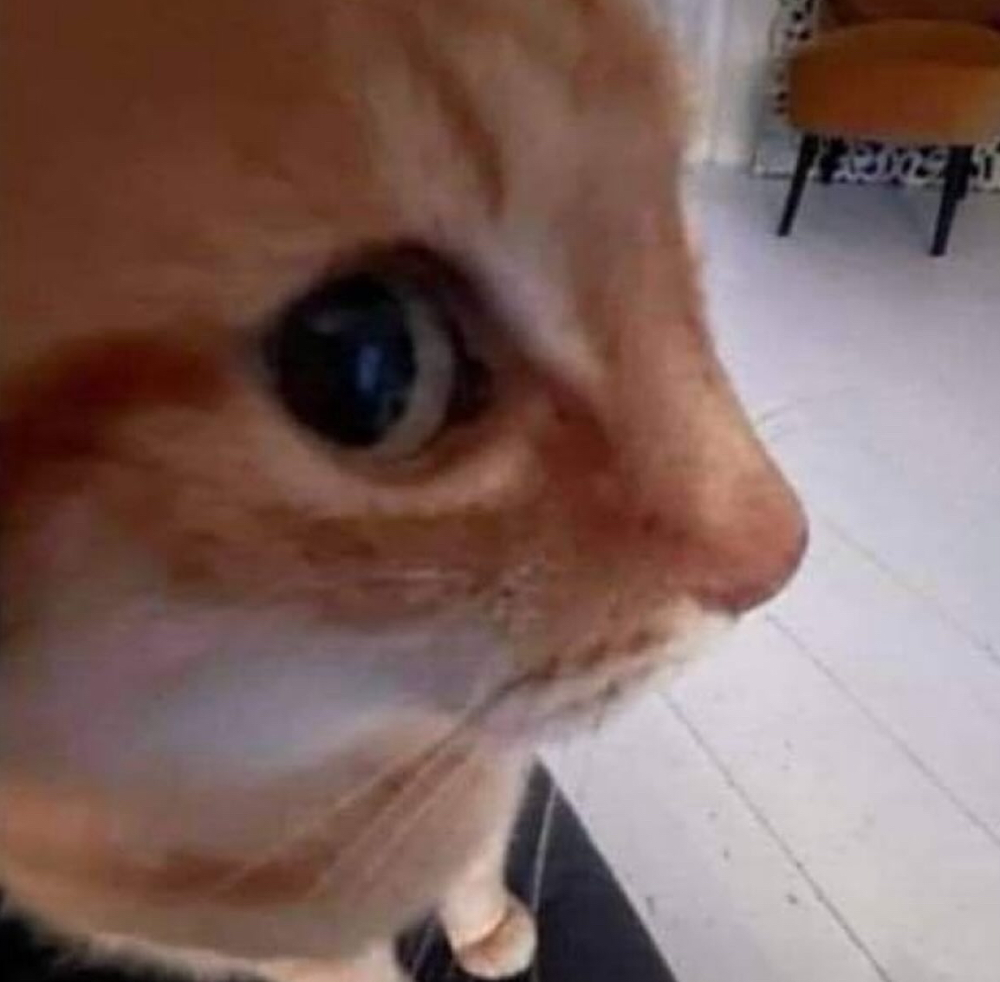

&nbsp;&nbsp;&nbsp;&nbsp; Gözbebeklerimde müebbet hüzün,

&nbsp;&nbsp;&nbsp;&nbsp; Dilimde ay kesiği bir yara,

&nbsp;&nbsp;&nbsp;&nbsp; Düşüm kırık dökük,

&nbsp;&nbsp;&nbsp;&nbsp; Umudumun boynu bükük,

&nbsp;&nbsp;&nbsp;&nbsp; Bir öksüzün omuzlarında sukut.

&nbsp;&nbsp;&nbsp;&nbsp; Yüreğim sana emanet sıkı tut

&nbsp;&nbsp;&nbsp;&nbsp; — Serkan Uçar, _Tut yüreğimden ustam şiiri_
