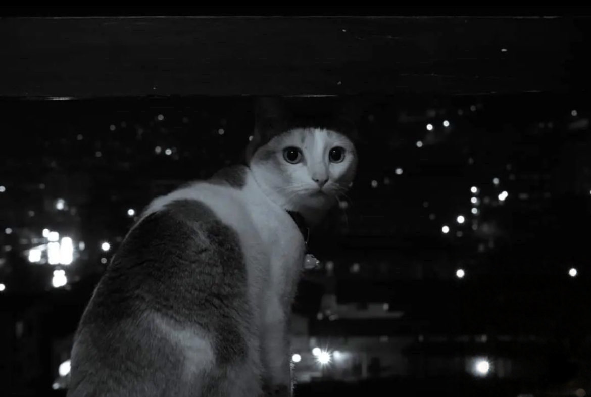

&nbsp;&nbsp;&nbsp;&nbsp; Unspoken feelings are unforgettable.

&nbsp;&nbsp;&nbsp;&nbsp; I think about the words we never said.

&nbsp;&nbsp;&nbsp;&nbsp; Question only heard by the midnight air.

&nbsp;&nbsp;&nbsp;&nbsp; I guess neither of us understood where we stood under the stars.

&nbsp;&nbsp;&nbsp;&nbsp; But I still look up with a longing for something I can't quite describe.

&nbsp;&nbsp;&nbsp;&nbsp; I wonder if you do the same.

&nbsp;&nbsp;&nbsp;&nbsp; Searching for constellation that details details our years.

&nbsp;&nbsp;&nbsp;&nbsp; Looking for an answer written in the sky.

&nbsp;&nbsp;&nbsp;&nbsp; I miss you.
