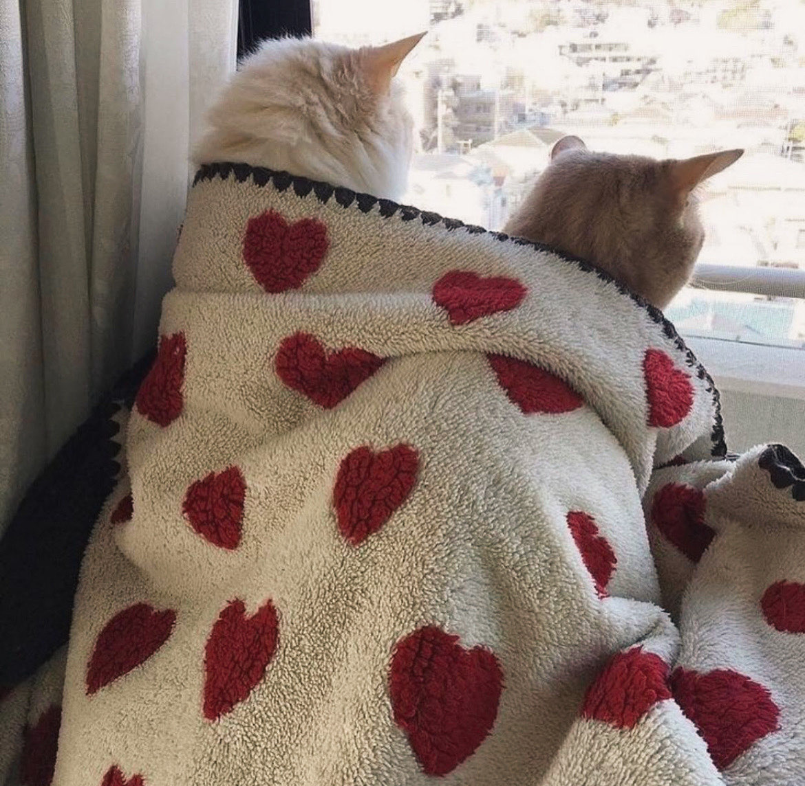

"Is there a pursuit to find our own willingness to love be reflected?"

I find the idea to search not for love, but a reflection of our willingness to love so beautiful, I'm moved to tears.

To me it speaks a truth about human desire. A testament to our innocence and better nature. The implication that love is innate.

We are not searching for love, we are already full of it.

While this might be a beautiful recognition to come to how much of it is really true?

At the end of the day I'm left with an empty bottle once more- somehow thirstier then before.
