## My very first roll of film

**Camera:** Minolta Hi Matic AF

**Film:** Kodak Gold 200

𓆝 𓆟 𓆞 𓆝 𓆟𓆝 𓆟 𓆞 𓆝 𓆟

Somehow not too bad.

𓆝 𓆟 𓆞 𓆝 𓆟𓆝 𓆟 𓆞 𓆝 𓆟

 on the Minolta!")

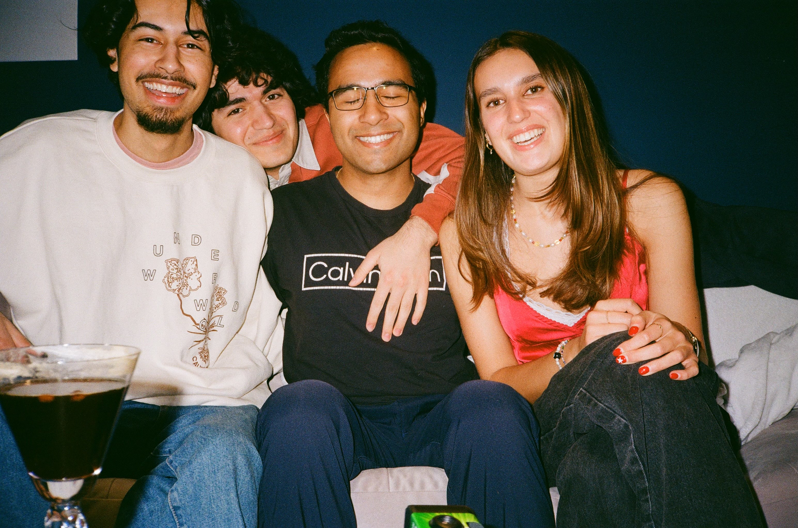

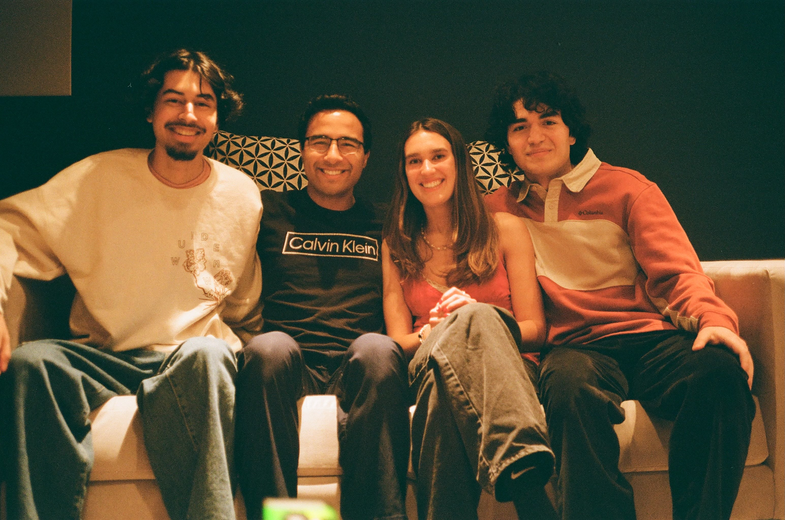

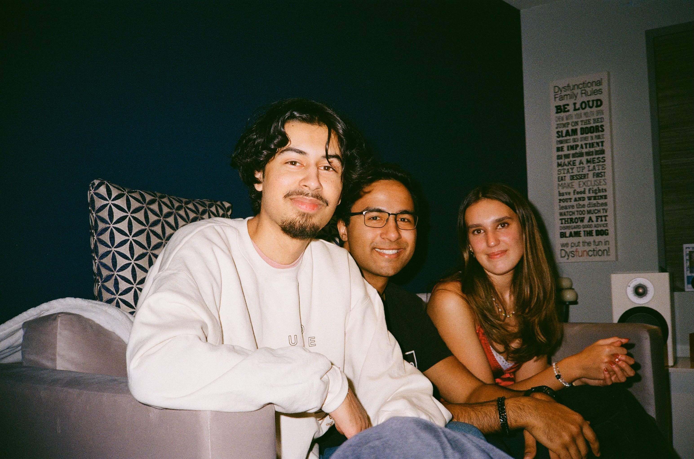

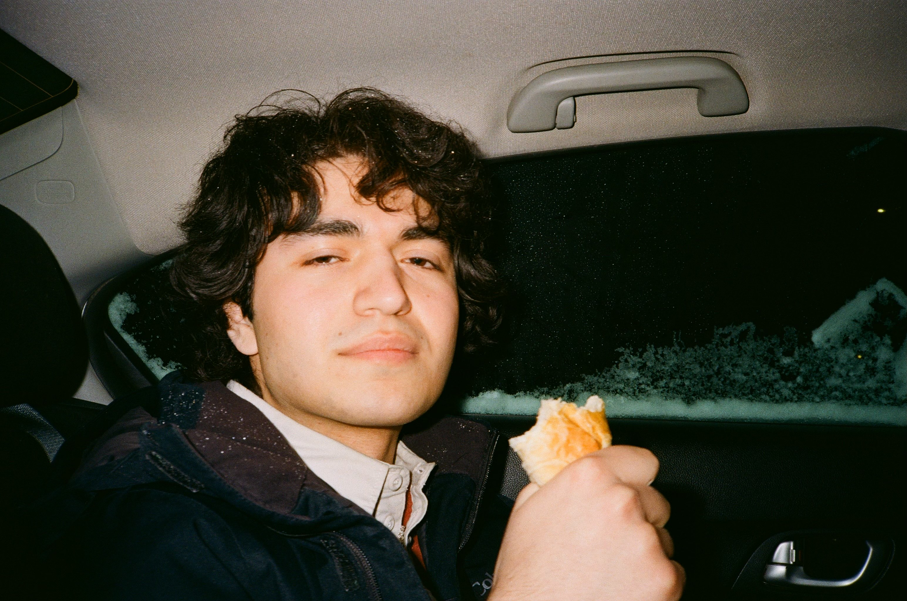

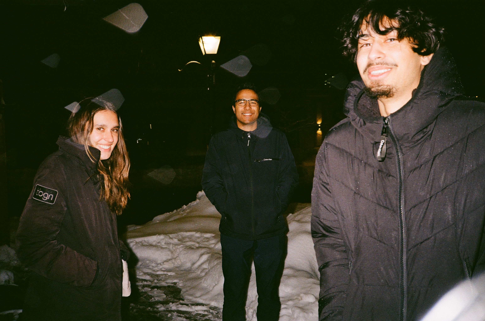

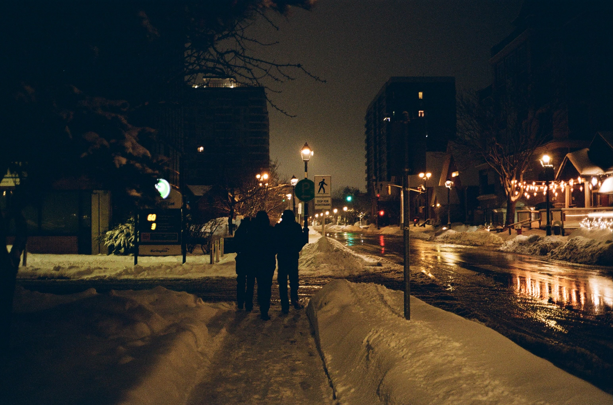

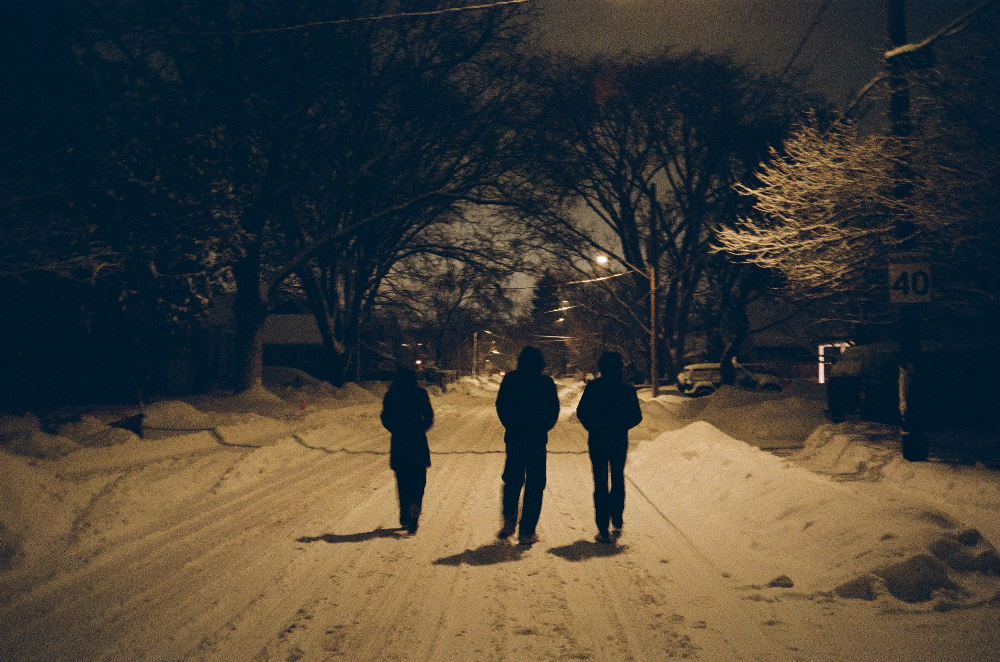

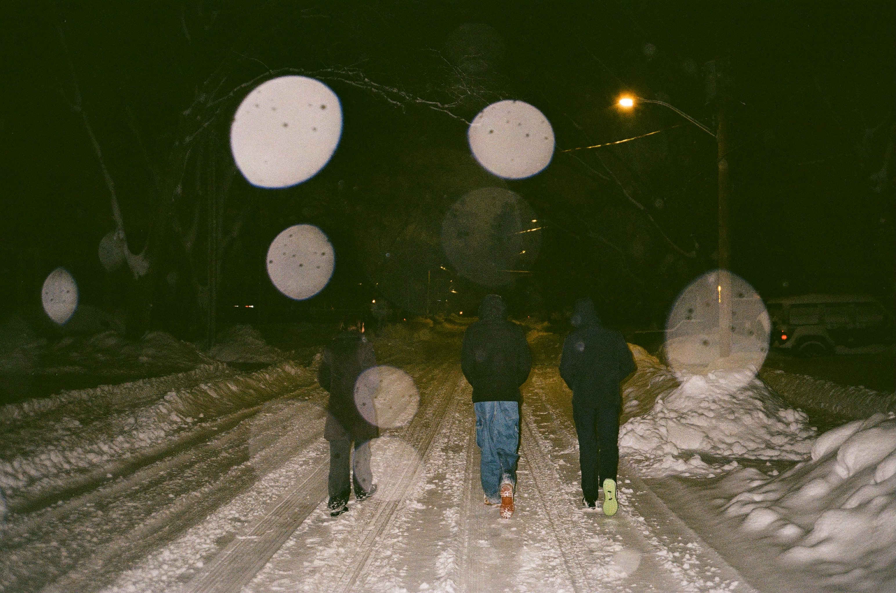

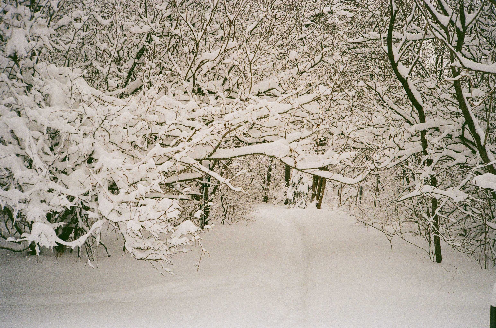

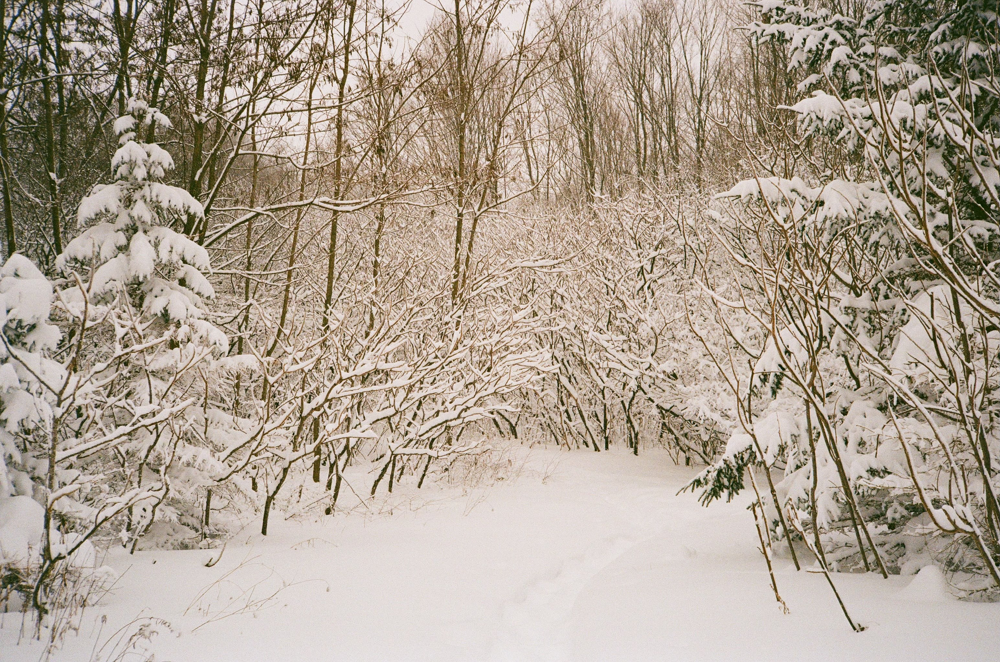

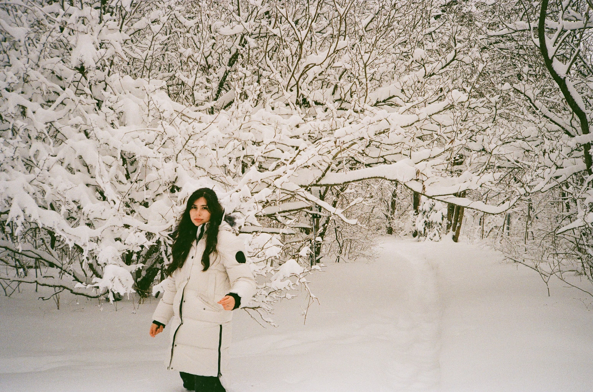

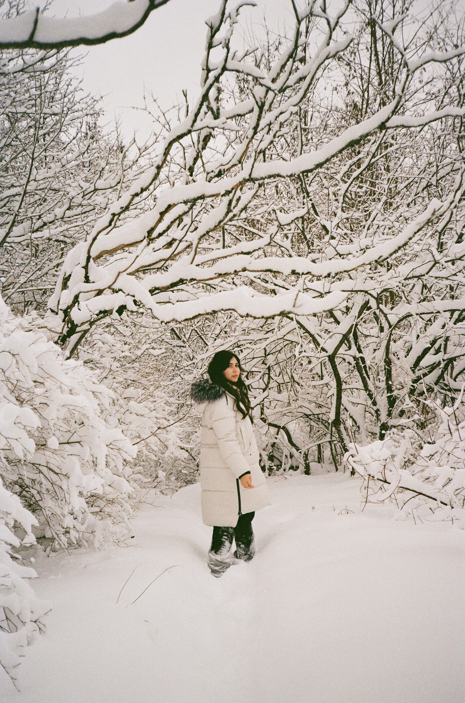

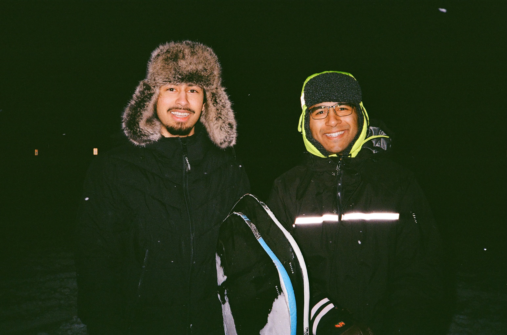

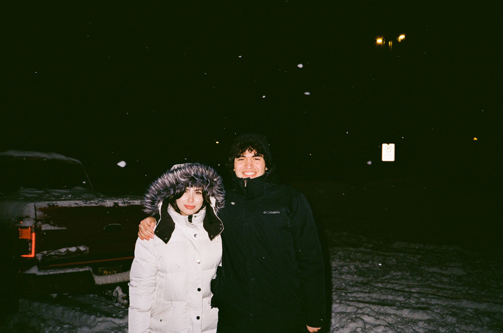

.")

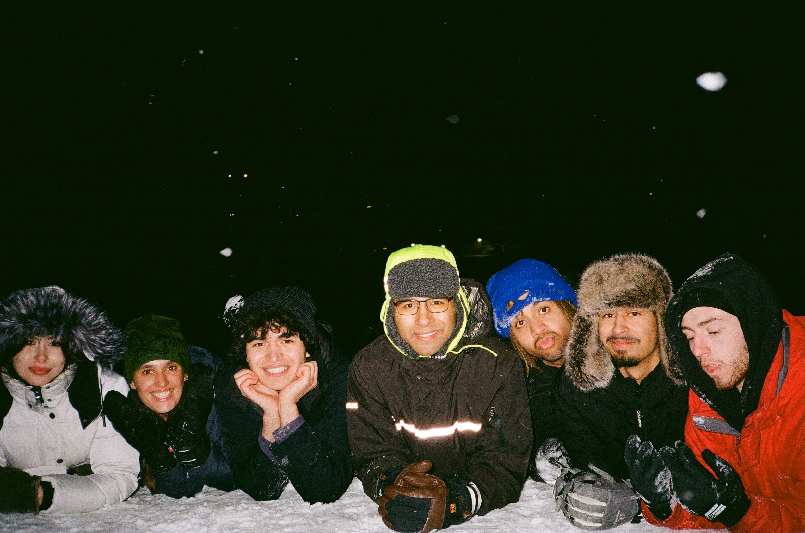
